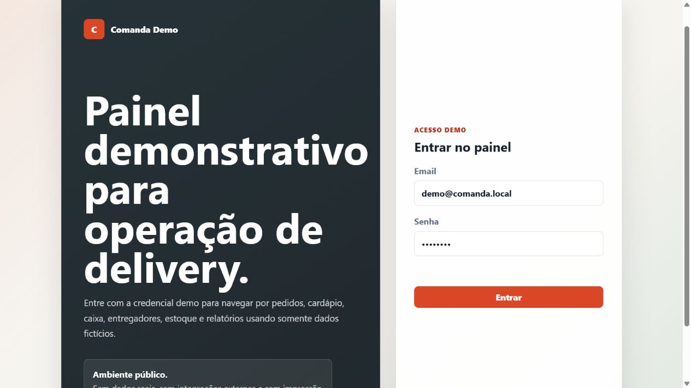
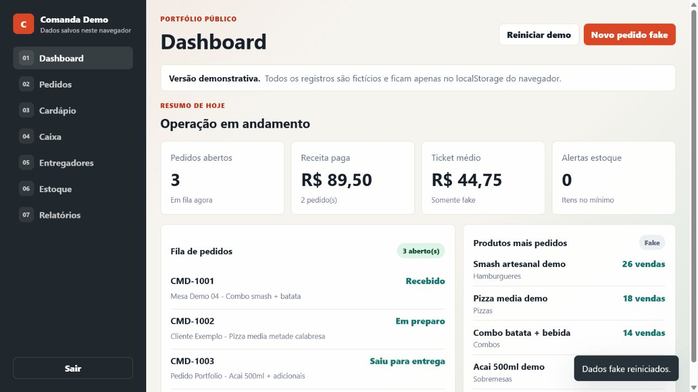
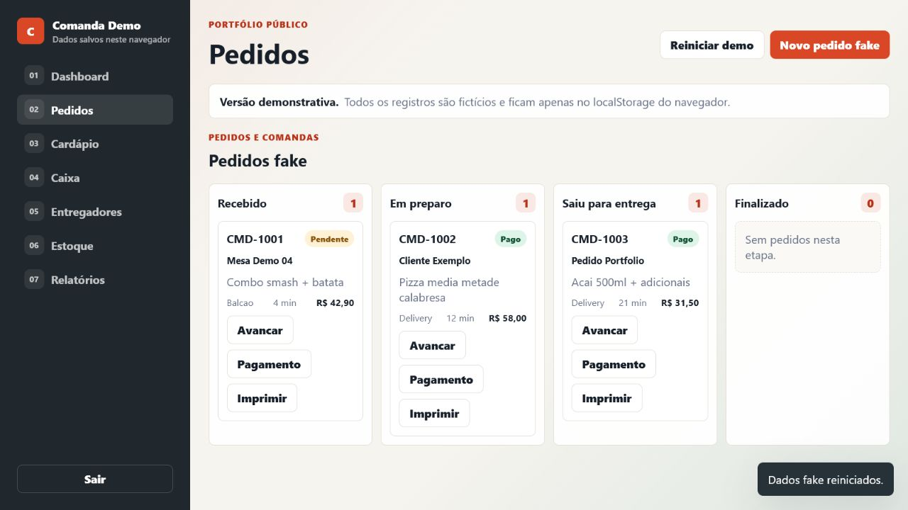
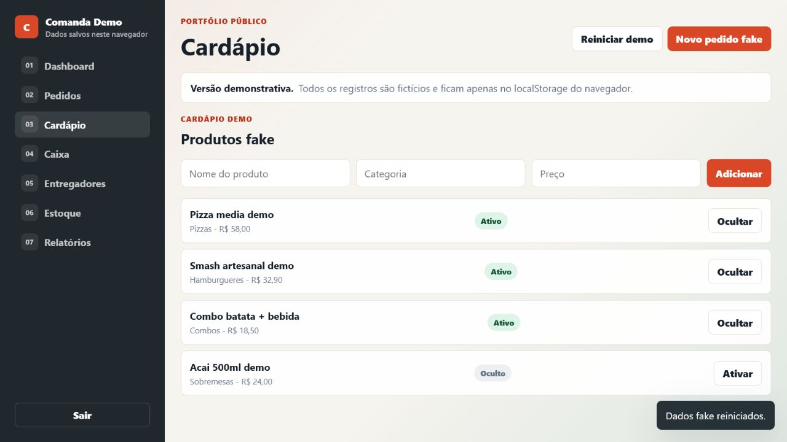
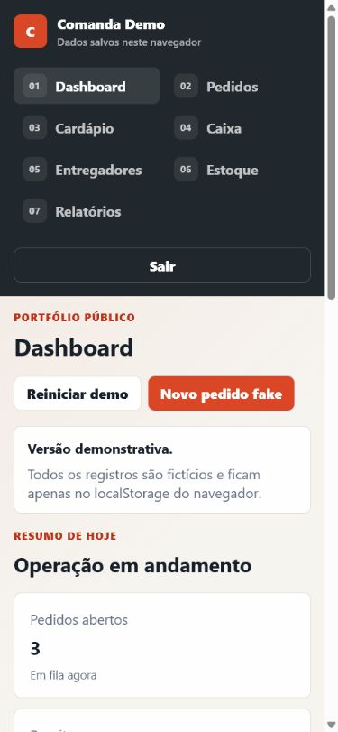

# Comanda Demo

Este repositório contém uma versão demonstrativa do Comanda, criada exclusivamente para fins de portfólio e avaliação técnica. Nenhum dado real de clientes, credenciais privadas, integrações de produção ou regras comerciais sensíveis da versão oficial estão presentes neste projeto.

## Sobre

Comanda Demo é uma vitrine pública e segura de um painel de gestão para operações de food delivery. A versão oficial/comercial do Comanda é privada; este repositório existe apenas para demonstrar interface, fluxo operacional e organização técnica em um ambiente sem dependências reais.

Esta demo não contém dados reais, credenciais de produção, banco real, chamadas externas, integrações reais de pagamento, impressão ou qualquer conexão com a versão comercial. Todos os dados são fictícios e ficam salvos em `localStorage` no navegador.

## Demonstração visual







## Funcionalidades demonstrativas

- Login demo.
- Dashboard com indicadores fictícios.
- Pedidos e comandas fake com mudanca de status.
- Cardápio/produtos fake.
- Caixa fake com entradas e saídas locais.
- Entregadores fake.
- Estoque básico fake.
- Relatórios simples calculados no navegador.
- Impressão simulada com mensagem de demonstração.
- Reinício dos dados fake a qualquer momento.

## Tecnologias

- HTML, CSS e JavaScript vanilla.
- `localStorage` para persistência demonstrativa.
- Servidor local simples com Node.js, sem dependências externas.

## Como rodar localmente

```bash
npm install
npm run check
npm run dev
```

Depois abra:

```text
http://127.0.0.1:4173
```

## Login demo

Email:

```text
demo@comanda.local
```

Senha:

```text
Demo@123
```

## Aviso de segurança

Esta versão pública não possui banco real, API real, RPC real, Supabase real, QZ Tray real, impressora real, credenciais privadas, chaves, tokens, dados de cliente ou ambiente de produção. O objetivo é permitir avaliação técnica sem expor a versão oficial do produto.
